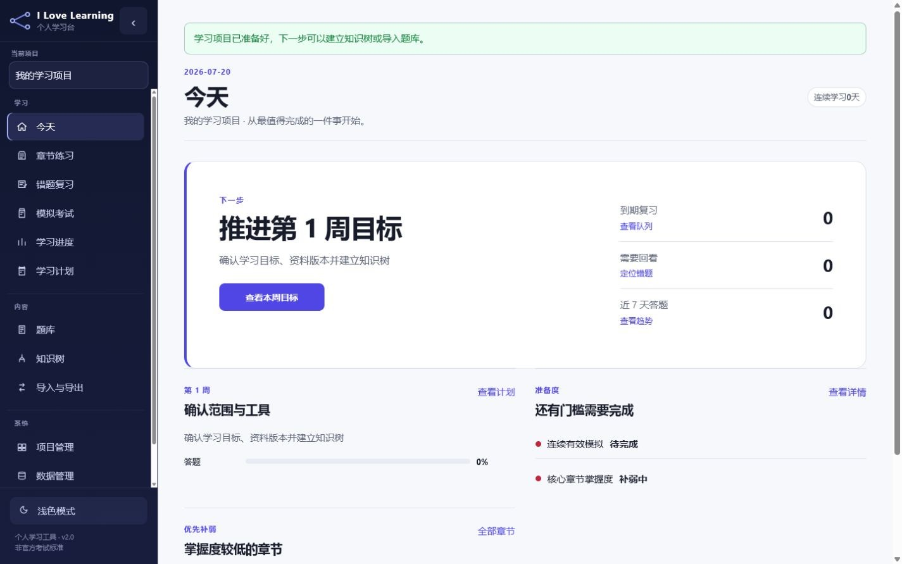
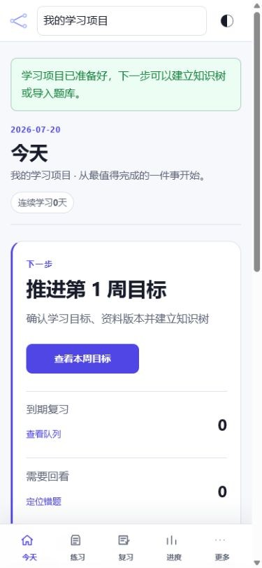

# 我爱学习（I Love Learning）

本地优先的多项目学习平台，用一套清晰的知识层级组织认证、课程与自学内容。它把题库、章节练习、间隔复习、模拟考试和学习进度连成完整闭环，数据默认只保存在自己的设备中。

Windows 用户可以免安装运行 Portable 版本，并在软件内 GUI 与浏览器 Web 两种打开方式间切换；Linux 服务器可使用 Docker Compose 部署。桌面与手机共用响应式蓝靛界面，首页优先告诉你“现在该学什么”，管理页面则保留适合大量题目的紧凑效率。

<p align="center">
  
  
</p>

## 核心功能

- **多项目组织**：以 `学习项目 → 科目 → 章节 → 知识点 → 题目` 管理不同目标，题库与进度彼此隔离。
- **完整学习闭环**：支持五类题型，以及可暂停恢复的章节练习、错题复习、模拟考试、掌握度与间隔复习。
- **按目标启用模块**：普通刷题、考试备考和实操认证三种模板，可按项目启用计划、实践任务和准备度。
- **双向题库流转**：支持 PDF、DOCX、XLSX、CSV 导入，以及经过结构与哈希校验的 ZIP 题库分享包。
- **跨设备但不依赖云端**：桌面左侧分组导航、手机五入口导航；可信局域网内可共享同一份本地数据。
- **数据可控**：知识节点迁移保留题目 ID 和学习记录，并提供快照、健康检查、备份与会话清理。

## 运行要求

- Windows 10/11，或支持 Docker Engine 的 Ubuntu/Debian Linux
- Windows 使用 Portable 包免安装运行；源码运行仅用于开发调试
- Linux 推荐使用 Docker Compose
- 手机访问时，手机与电脑需连接同一可信局域网

## Windows 快速开始

1. 下载 `I-Love-Learning-Portable.zip` 并完整解压。
2. 双击 `I-Love-Learning.exe`。
3. 首次启动时选择打开方式：“软件内打开（GUI）”或“浏览器打开（Web）”。
4. 确认数据目录；已有题库时选择原完整 `data` 目录，新用户可保留默认空目录。
5. 默认使用“仅本机访问”；需要手机访问时，在启动器中切换为“允许同一局域网访问”。
6. 全新空题库会显示首次设置向导，用一分钟选择项目名称和学习模板；已有题库不会显示该向导。

Portable 默认把数据保存在同级 `data`，也可以在启动器中选择独立数据目录。选择会保存在程序目录的 `.portable-launcher.json`；切换到空目录时可确认迁移完整数据。升级时保留数据目录和该配置文件；不要把运行中的 SQLite 数据库直接复制给别人，题库分享请使用软件内的 ZIP 导入与导出。详细说明见 [Windows Portable 使用与发布](docs/windows-portable.md)。

运行期间电脑和启动器必须保持开启。软件没有账号与登录保护，**不要配置公网端口映射，也不要在不可信网络中运行**。GUI 模式依赖系统 Microsoft Edge WebView2 Runtime；如 GUI 初始化失败，可改用浏览器 Web 模式。未签名 Portable EXE 可能触发 Windows SmartScreen，首次运行时需要手动允许。

## Linux 部署

Linux 服务器使用单容器 Docker Compose 部署，数据和备份保存在宿主机绑定目录，并仅绑定服务器内网 IP。完整步骤见 [Linux Docker Compose 部署](docs/linux-deployment.md)。

Windows 与 Linux 实例默认完全独立，不共享 SQLite，也不会自动同步题库或学习进度。Linux 全新部署首次启动为空题库。

## 数据与备份

数据库、题目图片、导入原件和配置都保存在数据目录。“数据管理”页面可以查看当前数据位置并创建完整快照；Windows 默认保存到 `%USERPROFILE%\Documents\I-Love-Learning-Backup`，Linux Docker 保存到配置的宿主机备份目录。恢复前先停止软件，再用快照中的完整 `data` 目录替换当前目录。归档项目不会删除内容；永久删除项目、非空知识节点和学习记录前都会自动备份。更多说明见 [数据目录管理](docs/data-management.md)。

公开仓库不会包含本机题库：`data`、`题库` 和 `backups` 均被 Git 忽略，全新克隆首次启动时会创建零题目的数据库和默认知识结构。

## 题库导入与分享

- 普通 PDF/DOCX 必须包含可复制的结构化文本，不支持 OCR；XLSX/CSV 使用页面提供的固定模板。
- 普通文档导入后统一进入草稿，人工核验后才会进入默认练习和模拟考试。
- ZIP 分享包可按项目、科目或章节导出，默认仅包含已核验题，不包含数据库 ID、来源资料和个人学习记录。
- ZIP 导入会先校验结构、文件哈希和压缩安全，再处理项目映射、重复题与审核状态。
- 分享包不加密，也不代表内容授权，请通过可信方式传递并自行确认分享权限。

<details>
<summary><strong>高级配置、公开提交与开发</strong></summary>

### 高级配置

支持 `STUDY_DATA_DIR`、`STUDY_DB_NAME`、`STUDY_BACKUP_DIR`、`STUDY_SECRET` 和 `STUDY_MAX_UPLOAD_MB`。未配置密钥时会在本地 `data` 中生成随机密钥；旧环境变量 `H3CSE_DATA_DIR`、`H3CSE_SECRET` 继续兼容。

运行日志保存在 `data/logs/app.log`，`/health` 提供只读数据库健康状态。SQLite 使用 WAL，导入和导出任务串行执行，适合个人电脑和家庭局域网使用。

### 发布前检查

提交、推送或创建 Release 前运行：

```powershell
.venv\Scripts\python tools\release\check_release_ready.py
```

检查脚本只读，不会提交、推送、创建 Release 或上传资产；它会运行公开仓库检查、语法检查、Ruff、完整测试、分支覆盖率门禁和依赖漏洞审计。数据库升级前会自动创建完整快照，并在迁移后检查 SQLite 完整性和外键。不要运行 `git clean -fdx`，因为 `-x` 会删除被忽略的本地学习数据。发布流程见 [GitHub 发布流程](docs/release-flow.md)。

### 开发与测试

```powershell
.venv\Scripts\python -m pip install -r requirements-dev.txt
.venv\Scripts\python -m ruff check .
.venv\Scripts\python -m coverage run -m unittest discover -s tests -v
.venv\Scripts\python -m coverage report --fail-under=65
.venv\Scripts\python -m pip_audit -r requirements.txt
```

应用使用 `create_app(config)` 创建相互隔离的运行实例；首次空数据库启动会显示约一分钟的项目向导，已有题库不会被打断。源码方式只用于开发调试，不作为普通 Windows 使用入口。如需从源码临时启动：

```powershell
.venv\Scripts\python -m waitress --listen=127.0.0.1:23456 app:app
```

### 构建 Windows Portable

```powershell
tools\release\windows\build_portable_windows.ps1 -Python .venv\Scripts\python.exe
tools\release\windows\smoke_portable_windows.ps1 -Python .venv\Scripts\python.exe
```

构建产物位于 `dist\I-Love-Learning-Portable.zip`，并生成对应 SHA-256 文件；解包 staging 位于 `build\portable-staging`，不会删除或覆盖 `dist` 中曾经解压的软件数据。发布包默认不包含数据库、题库文档或本机导入文件。

</details>

领域术语见 [CONTEXT.md](CONTEXT.md)，关键取舍见 [关键设计决定](docs/decisions.md)。

## 许可证

当前仓库尚未附带开源许可证。除非另有书面许可，不授予复制、修改或再分发本项目代码的权利。

学习统计和准备度只用于个人学习决策，不代表任何机构的官方考试标准。
